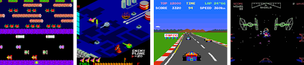
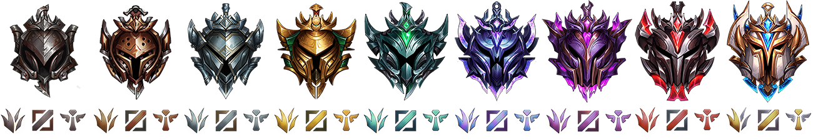

```{r setup, include=FALSE}
#knitr::opts_chunk$set(echo = TRUE, error=TRUE, message=FALSE, warning=FALSE)
```

```{r libraries, echo=FALSE}
library(tidyverse)     # for data cleaning and plotting
library(lubridate)     # for date manipulation
library(ggthemes)      # for more themes (including theme_map())
library(gganimate)     # for adding animation layers to ggplots
library(gifski)        # for creating the gif (don't need to load this library every time,but need it installed)
library(transformr)    # for "tweening" (gganimate)
library(patchwork)     # for nicely combining ggplot2 graphs  
library(gt)            # for creating nice tables
library(stringr)       # for string conversions
library(ggimage)       # for reading in images
library(png)
```

```{r data, echo = FALSE}
GeneralEsportData <- read.csv("GeneralEsportData.csv")

HistoricalEsportData <- read.csv("HistoricalEsportData.csv") %>% 
  mutate(Date = dmy(Date)) %>% 
  mutate(year = year(Date))

high_diamond_ranked_10min <- read.csv("high_diamond_ranked_10min.csv")

twitchdata <- read.csv("twitchdata.csv")

pro_lol_matches <- read.csv("matches2020.csv")

team_earnings <- read.csv("ee.csv")

lol_tournament_earnings <- read.csv("lolearningsbyteam.csv")

pro_indepth_stats <- read.csv("08_19_2020.csv") %>% 
  filter(league %in% c("LPL", "LCS", "LCK", "LEC")) %>% 
  select(c("league", "patch", ends_with(c("dragons", "elders", "heralds", "barons", "towers", "inhibitors", "totalgold", "result")))) %>% 
  arrange(league)
```

## The Growing Esports Industry
  
The first competitive games started on arcade machines in the late 1970s with Space Invader and Twin Galaxies where the professional players strive to beat each other's record to become the world record holder. In the 1980s, more games were released that many of us know today like Pac-Man. A shift from arcades to gaming consoles occurred with the release of Nintendo systems. The new popularized way of gaming was becoming more accessible to the average consumer than ever before. As Nintendo continued to grow through the 1990s, the fast advancing computer technology became a new and different mode of gaming with personal computers. 



The large amount of competitive users led to organized competitions where tens of millions of fans of the top games follow these matches allowing the game companies to profit. Eventually these competitive matches transformed into a sport known as Esports. Many of the top games help create and influence the start of Esports teams and organizations made of world-class gamers. In total, hundreds of millions of US dollars are profitted from the Esports industries only in terms of prize earnings from professional tournaments. 

- (HERE OF BEFORE THE PARAGRAPH ABOVE) DISCUSS THE DATA COLLECTION PROCESS AND POSSIBLY A CLEARER INTRO TO THE TOPIC IF NOT CLEAR ENOUGH ALREADY 

```{r echo = FALSE}
barlinegraph <- HistoricalEsportData %>% 
  group_by(year) %>% 
  summarise(sumEarnings = sum(Earnings)/1000000) 
  
  
growth_time <- ggplot(barlinegraph, aes(x = year,
             y = sumEarnings))+
  geom_col(color = "darkblue",
           fill = "white")+
  geom_line(color = "red",
            size = 1)+
  labs(title = "Esports Professional Matches Prize Earnings",
       subtitle = "(Millions of US Dollars)",
       x = "",
       y = "",
       caption = "Data from EsportsEarnings.com")+
  theme_minimal()

perspectivebar <- HistoricalEsportData %>% 
  mutate(era = ifelse(year >= 1998 & year <= 2017,
                      "1998 - 2017",
                      "2018 - 2020")) %>%
  group_by(era) %>%
  summarise(total_earnings = sum(Earnings)/1000000) %>% 
  ggplot(aes(x = era,
             y = total_earnings,
             fill = era))+
  geom_col()+
  labs(y = "",
       x = "",
       caption = "Created by Charlie Tran")+
  theme_minimal()+
  theme(legend.position = "none")

growth_time + perspectivebar 
```

As seen above, in late 1990s to the late 2010s there was a exponential growth in the tournaments' prize earnings from all Esports teams, orgnaizations, and all variety of competitive. In fact the earnings from tournaments in the last 3 years totals to more than the 20 years before! Unfortunately for the Esports industry in 2020, the toll of the COVID-19 pandemic is evident where large gatherings were impossible to view the professional matches. the canceled tournaments destryed the potential of growth of Esports although some game companies like Riot Games worked with the teams to provide a remote competitive experience to provide a fair tournament to take place (more on this later).

These Esports organizations are created with a focus on a specific game and eventually grow from tournament prizes.

```{r, echo=FALSE}
top_team_earnings <- team_earnings %>% 
  arrange(desc(TotalUSDPrize)) %>% 
  filter(TotalUSDPrize > 9000000)

teamliquid <- "Team_Liquidlogo.png"
og <- "OG_Esportslogo.png"
evilgeniuses <- "eglogo.png"
fnatic <- "Fnaticlogo_square.png"
virtus.por <- "Virtus.prologo_square.png"
newbee <- "Newbeelogo_square.png"
vicigaming <- "600px-VICI_Gaming.png"
teamsecret <- "Team_Secret_(Vietnamese_Team)logo_square.png"
invictusgaming <- "png-transparent-dota-2-asia-championships-2015-the-international-2014-invictus-gaming-evil-geniuses-others-game-burning-logo.png"
natusvincere <- "NaVi_logo.png"
lgdgaming <- "LGD_Gaminglogo_square.png"
cloud9 <- "1280px-Cloud9_logo.svg.png"
skt <- "SK_Telecom_T1logo_square.png"
wingsgaming <- "600px-Wings.png"
parissaintgermain <- "Paris_Saint-Germain_eSportslogo_square.png"
fazeclan <- "1200px-Faze_Clan.png"

top_team_images <- tibble(image = c(teamliquid, og, evilgeniuses, fnatic, virtus.por, newbee,
                                       vicigaming, teamsecret, invictusgaming, natusvincere, lgdgaming,
                                       cloud9, skt, wingsgaming, parissaintgermain, fazeclan))

top_team_earnings_images <- top_team_earnings %>% 
  mutate(top_team_images)

top_team_earnings_images %>% 
  ggplot(aes(x = TotalUSDPrize/1000000,
               y = fct_reorder(TeamName, TotalUSDPrize),
             fill = TotalUSDPrize))+
  geom_col()+
  geom_image(aes(image = image), 
             size = 0.05)+
  theme_minimal()+
  theme(legend.position = "none")+
  scale_x_continuous()+
  labs(title = "Total Tournament Earnings by Team",
       subtitle = "(Millions of US Dollars)",
       x = "",
       y = "",
       caption = "Data from EsportsEarnings.com, Created by Charlie Tran")
```

The bargraph above shows the top Esports organzations/teams around the world with teams that have contracted professional players who competed in professional matches and earn the tournaments prizes. One of the games that provide one the largest percent of the organization's total earnings is League of Legends.

```{r echo=FALSE}
lol_vs_total_earnings <- lol_tournament_earnings %>% 
  filter(TeamName %in% c("Team Liquid", "OG", "Evil Geniuses", "Fnatic", "Virtus.pro", "Newbee",
                       "Vici Gaming", "Team Secret", "Invictus Gaming", "Natus Vincere", "LGD Gaming",
                       "Cloud9", "SK Telecom T1", "Wings Gaming", "Paris Saint-Germain Esports", 
                       "Faze Clan")) %>% 
  left_join(top_team_earnings,
            by = "TeamName") %>% 
  select(-starts_with("TeamId")) %>% 
  select(-starts_with("TotalTour")) %>% 
  pivot_longer(cols = starts_with("TotalUSDPrize"),
               names_to = "variable",
               values_to = "prize_earnings") %>% 
  mutate(variable = ifelse(variable == "TotalUSDPrize.x", 
                           "Total Prized Earned \n(League of Legends)",
                           "Total Prize Earned"))

percentage_lol_earnings <- lol_tournament_earnings %>% 
  filter(TeamName %in% c("Team Liquid", "OG", "Evil Geniuses", "Fnatic", "Virtus.pro", "Newbee",
                       "Vici Gaming", "Team Secret", "Invictus Gaming", "Natus Vincere", "LGD Gaming",
                       "Cloud9", "SK Telecom T1", "Wings Gaming", "Paris Saint-Germain Esports", 
                       "Faze Clan")) %>% 
  left_join(top_team_earnings,
            by = "TeamName") %>% 
  select(-starts_with("TeamId")) %>% 
  select(-starts_with("TotalTour")) %>% 
  mutate(proportion = TotalUSDPrize.x/TotalUSDPrize.y)
 

graph3 <- lol_vs_total_earnings %>%
  ggplot() +
  geom_col(aes(x = prize_earnings/1000000,
               y = fct_reorder(TeamName, prize_earnings))) +
  facet_grid(vars(variable))+
  theme_minimal()+
  labs(x = "Millions of US Dollars",
       y = "")

graph4 <- percentage_lol_earnings %>% 
  ggplot(aes(x = fct_reorder(TeamName, proportion),
             y = proportion))+
  geom_col()+
  theme_minimal()+
  labs(title = "Proportion of Prize Earned from \nLeague of Legends",
       x = "", 
       y = "")+
  theme(axis.text.x = element_text(angle = 45, hjust=1))

graph4 + graph3 + labs(caption = "Data from EsportsEarnings.com, Created by Charlie Tran")
```

Of the top four Esports teams that have earned the majority of their prize from professional tournaments from League of Legends, the three teams, SK Telecom T1, Invictus Gaming, and Fnatic, have all won the international League of Legends Worlds tournament. League of legends have impacted the massive growth of the largest Esports teams in the world.

## What is League of Legends?


But before we can discuss the impact of League of Legends, it is good to know what the praise and large following of the game is about. Created in 2009, League legends is a team multiplayer online battle arena where the two teams made of 5 players where the goal is to defeat the enemies' "nexus" or their base located on opposite sides of the map. The map, called "Summoner's Rift, is split by three lanes lined with three turrets in each lane and two more turrets protecting the nexus for each side of the map. In between each lane is an area known as the jungle where jungle monsters (raptors, krugs, wolves, gromp, golem, blue sentinel, and red brambleback)reside. There is also a river that runs across the map with pits home to the Rift Herald, Baron Nashor, and Elemental Dragons. 

Each team chooses a champion that spawn on the map that have with an assigned role: top lane, mid lane, bot lane, support (also in the bot lane), and jungler. Based of the name of their roles, they will play the game in those repective locations. When the game starts, the lane players (also called laners) meet each other in their lane with a small group of minions that continously respawn and walk from the nexus down their repective lanes, while the jungler traverses through the jungle. In each lane, the laners goal is to kill the minions for earning in game gold and also attempt to kill the opposing enemy laner which also grants them a significant amount more gold. The junglers also earn in game gold by killing the jungler monsters or visiting a lane to kill the enemy. This process of killing minions, monsters, and enemy players goes on as each player accumulates gold in order to purchase specialized items to increase the strength and health of each player's champion. The stronger the champion becomes the higher the chance the team can kill the enemies and push towards their base to destroy the nexus and win the match.

The becomes much more complicated when professional players and teams consider the smallest details, stats, and actions. A small mistake by buying the wrong in game item or walking to the wrong area and getting ambushed by the enemy can turn the game around towards the team that would seem to be losing. But what statistics will majorly determines the likelihood the team will win?

```{r echo=FALSE}
lol_blue_side <- high_diamond_ranked_10min %>% 
  select(-starts_with("red"))

lol_red_side <- high_diamond_ranked_10min %>% 
  select(-starts_with("blue"))

blueGoldDiff <- high_diamond_ranked_10min %>% 
  arrange(blueGoldDiff) %>%             
  filter(blueGoldDiff > 0) %>% 
  summarise(bluewinrate = sum(oneisblueWins)/n()*100)

redGoldDiff <- high_diamond_ranked_10min %>% 
  arrange(redGoldDiff) %>% 
  filter(redGoldDiff > 0) %>% 
  summarise(redwinrate = (1-sum(oneisblueWins)/n())*100)

bargraph_goldDiff <- tibble(side = c("Blue","Blue", "Red", "Red"), 
                            iswin = c("win", "lose", "win", "lose"),
                            winrate = as.numeric(c(blueGoldDiff, 100-blueGoldDiff, redGoldDiff, 100-redGoldDiff)))


soloq_golddiff <- ggplot(bargraph_goldDiff, aes(x = side, y = winrate, fill = iswin))+
  geom_bar(stat = "identity", position = 'dodge')+
  theme_minimal()+
  scale_fill_discrete(name = NULL,
                      labels = c("Lose", "Win"))+
  labs(title =  "Non-Professional Games \nwith a Positive Gold Difference",
       x = "", 
       y = "Percent Winrate")

soloq_golddiff
```

Before I can answer this question, I will explain what the data is collected on. In multiplayer League of Legends, there are two main gamemodes on Sommoner's Rift: Normal and Ranked. The difference between the two gamemodes is Ranked gives the players a tier from Iron to Challenger where the players can climd the tier ladder by earning "LP" points. another thing to note is when a player quenes up for a game match on the Summoner's Rift map they will spawn on the right side nexus of the left side nexus where right is blue side and left is red side.

The graph above shows the data collected from over 9,800 Diamond ranked games from the Western European server. The focus of this specific analysis for League of Legends shows that among the many variables inside the game over 70% of the games a team wins by non professional players are greatly impacted by the positive gold difference relative to the opposing team where the gold is earned by farming minions and jungle monsters, killing the enemy, and accomplishing the objectives that give gold.



Other factors that lead to the result of the game that are less related (although paritally involve gold game for the players) are objectives. In the game on Summoner's Rift there are certain objectives to help the team pull ahead to reach the final goal of destroying the nexus.
The following is a general list of objectives that the team can achieve located in the pits around the river of the map:
- Rift Herald: killing this creature gives the player a drop that can be spawned to act as a battering ram against turrents and other enemy structures that will grant gold to the players
- Elemental Dragons: There are four elemental dragons that the players can kill that will grant the entire team a buff in creased in a certain stat based on whcih dragon is slain
- Baron Nashor: A giant serpent-like creature that when killed grants the the player 300 gold on the team. Also gives them power of strengthen the ally minions when the payer is close enough to the minions.
- Elder Dragon: killing the Elder dragon grants the team 250 gold and strongest individual buff to each player that lasts for a short time.

```{r echo=FALSE}

lol_objectives_lead_towin <- high_diamond_ranked_10min %>% 
  select(ends_with(c("gameId", "blueWins", "TowersDestroyed", "Dragons", "Heralds", "EliteMonsters"))) 

lol_objectives_lead_towin <- lol_objectives_lead_towin %>% 
  mutate(objective_score_blue = rowSums(lol_objectives_lead_towin[, c(2,4,6,8)])) %>% 
  mutate(objective_score_red = rowSums(lol_objectives_lead_towin[, c(3,5,7,9)])) %>% 
  mutate(objscore_compare = ifelse((objective_score_blue > objective_score_red) & oneisblueWins ==1, 
                                   "Expected",
                                   ifelse((objective_score_blue < objective_score_red) & oneisblueWins == 0, 
                                          "Expected",
                                          ifelse(objective_score_blue == objective_score_red, 
                                                 "Undefined", 
                                                 "Unexpected"))))

# lol_objectives_lead_towin_table <- lol_objectives_lead_towin %>% 
#   mutate(oneisblueWins = ifelse(oneisblueWins == 0, "Loss", "Won")) %>% 
#   select(oneisblueWins, objective_score_blue, objective_score_red, objscore_compare) 
# 
# colnames(lol_objectives_lead_towin_table)[1] <- "Blue Team Result"
# colnames(lol_objectives_lead_towin_table)[2] <- "Blue Team Objective Score"
# colnames(lol_objectives_lead_towin_table)[3] <- "Red Team Objective Score"
# colnames(lol_objectives_lead_towin_table)[4] <- "Prediction"

  
ggplot(lol_objectives_lead_towin, aes(x = objscore_compare))+
  geom_bar()+
  labs(title = "Prediction of Diamond Games Given Objective Score",
       x = "",
       y = "Number of Games")+
  theme_minimal()
```

For each objective that the team achieves from the list above within a match, one objective point is given to the blue/red team. The graph above shows how completing objectives can result in a win. Matches labeled "Expected" means a team's objective score is higher than the other team and the final result is the team with the higher score won. Matches labeled "Undefined" means the objective score for both teams are equal so the result of the match depends on other factors. Matches labeled "Unexpected means a team's objective score is lower than the other team and the final result is the team with the lower score won. Over 60% of the matches in over 9800 Diamond ranked games show that completing objectives

So what does all this data mean for the average League of legends?
In order for you to have the best chance possible to win the game, it is extremely important to farm minions and kill jungle monsters to have the safest path towards earning the most gold without dying by the enemy and winning a game. 

## Professional League of Legends Esports

-talk about how i only selected the top 4 regions
-use the data and explain its meaning
- use the high diamond ranked games data 
- use the pro matches to show the level and difference between diamond and pro player games

```{r echo = FALSE}
pro_lol_revised <- pro_lol_matches %>% 
  filter(league %in% c("LPL", "LCS", "LCK", "LEC")) %>% 
  mutate(redwin = ifelse(result == 1, 0, 1))

pro_lol_wins <- tibble(team = c(pro_lol_revised$blueteam, pro_lol_revised$redteam),
                       result = c(pro_lol_revised$result, pro_lol_revised$redwin),
                       league = c(pro_lol_revised$league, pro_lol_revised$league)) %>% 
  group_by(league, team) %>% 
  summarise(winrate = (sum(result)/n())*100) %>% 
  arrange(league, desc(winrate)) %>% 
  ungroup()

pro_lol_wins %>% 
  group_by(league) %>% 
  slice_head(n = 3) %>% 
  ggplot(aes(y = league,
           x = winrate,
           color = team))+
  geom_bar(stat = "identity", 
           position = 'dodge')+
  geom_text(aes(label = team), 
            position = position_dodge(0.9), 
            hjust = 1.1)+
  theme_minimal()+
  labs(title = "Top Winrates of Professional League of Legends Teams",
           x = "Percent Winrate",
           y = "League")+
  theme(legend.position = "none")
  
  
```

```{r echo = FALSE}
pro_indepth_stats_gold <- pro_indepth_stats %>% 
  mutate(t1totalGold = rowSums(pro_indepth_stats[,17:21])) %>% 
  mutate(t2totalGold = rowSums(pro_indepth_stats[,22:26])) %>% 
  mutate(goldDiff = t1totalGold - t2totalGold) 

pro_indepth_stats_goldblue <- pro_indepth_stats_gold %>% 
  filter(goldDiff > 0) %>% 
  summarise(winrate = sum(t1_result/n())*100)

pro_indepth_stats_goldred <- pro_indepth_stats_gold %>% 
  filter(goldDiff < 0) %>% 
  summarise(winrate = sum(t2_result/n())*100)

pro_indepth_stats_goldwinrate <- tibble(team = c("Blue", "Blue", "Red", "Red"),
                                        result  = c("win", "lose", "win", "lose"),
                                        winrate = as.numeric(c(pro_indepth_stats_goldblue, 100-pro_indepth_stats_goldblue, 
                                                    pro_indepth_stats_goldred, 100-pro_indepth_stats_goldred)))

pro_golddiff <- ggplot(pro_indepth_stats_goldwinrate, aes(x = team, y = winrate, fill = result))+
  geom_bar(stat = "identity", position = 'dodge')+
  theme_minimal()+
  scale_fill_discrete(name = NULL,
                      labels = c("Lose", "Win"))+
  labs(title = "Professional Games \nwith a Positive Gold Difference",
       x = "",
       y  = "Percent Winrates")+
  theme(legend.position = "none")

soloq_golddiff + pro_golddiff
```

```{r echo = FALSE}

```
## Why is this game imapctful to Esports?

- TALK ABOUT TWITCH   

```{r echo = FALSE}

```