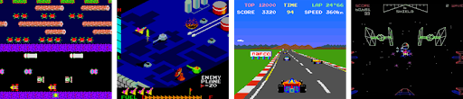
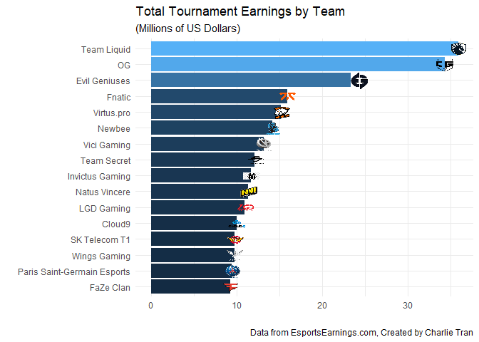
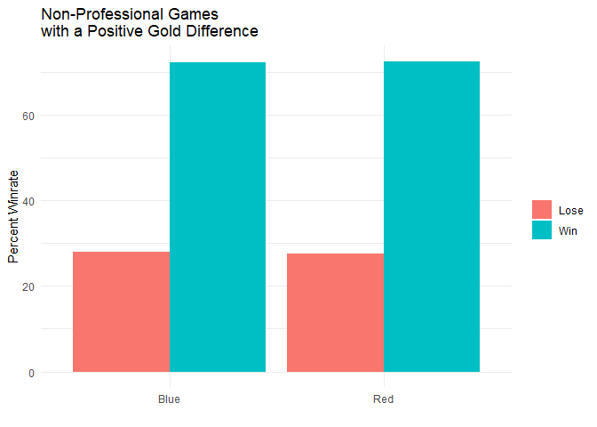

## The Growing Esports Industry
  
  
The first competitive games started on arcade machines in the late 1970s with Space Invader and Twin Galaxies where the professional players strive to beat each other's record to become the world record holder. In the 1980s, more games were released that many of us know today like Pac-Man. A shift from arcades to gaming consoles occurred with the release of Nintendo systems. The new popularized way of gaming was becoming more accessible to the average consumer than ever before. As Nintendo continued to grow through the 1990s, the fast advancing computer technology became a new and different mode of gaming with personal computers. 

The large amount of competitive users led to organized competitions where tens of millions of fans of the top games follow these matches allowing the game companies to profit. Eventually these competitive matches transformed into a sport known as Esports. Many of the top games help create and influence the start of Esports teams and organizations made of world-class gamers. In total, hundreds of millions of US dollars are profitted from the Esports industries just through professional tournament prize earnings. 

<!-- -->

As seen above, in late 1990s to the late 2010s there was a exponential growth in the tournaments' prize earnings from all Esports teams, orgnaizations, and all variety of competitive. In fact the earnings from tournaments in the last 3 years totals to more than the 20 years before! Unfortunately for the Esports industry in 2020, the toll of the COVID-19 pandemic is evident where large gatherings were impossible to view the professional matches. The canceled tournaments destroyed the potential of growth of Esports although some game companies like Riot Games worked with the teams to provide a remote competitive experience and a fair tournament to take place (more on this later).

These Esports organizations are created with a focus on a specific game and eventually grow from tournament prizes to create different teams for different competitive games. Turning a team into an organization.

<!-- -->

The bargraph above shows the top Esports organzations/teams around the world with teams that have contracted professional players who competed in professional matches and earn the tournaments prizes. One of the games that provide one the largest percent of the organization's total earnings is League of Legends.

<!-- -->

Of the top four Esports teams that have earned the majority of their prize from professional tournaments from League of Legends, the three teams, SK Telecom T1, Invictus Gaming, and Fnatic, have all won the international League of Legends Worlds tournament that provides a large monetary prize. League of legends have impacted the massive growth of the largest Esports teams in the world.

## What is League of Legends?

But before we can discuss the impact of League of Legends, it is good to know what the praise and large following of the game is about. Created in 2009, League legends is a team multiplayer online battle arena where the two teams made of 5 players where the goal is to defeat the enemies' "nexus" or their base located on opposite sides of the map. The map, called "Summoner's Rift, is split by three lanes lined with three turrets in each lane and two more turrets protecting the nexus for each side of the map. In between each lane is an area known as the jungle where jungle monsters (raptors, krugs, wolves, gromp, golem, blue sentinel, and red brambleback) reside. There is also a river that runs across the map with pits home to the Rift Herald, Baron Nashor, Elemental Dragons, and Elder Dragon. 

Each team chooses a champion that spawn on the map that have with an assigned role: top lane, mid lane, bot lane, support (also in the bot lane), and jungler. Based of the name of their roles, they will play the game in those respective locations. When the game starts, the lane players (also called laners) meet each other in their lane with a small group of minions that continuously spawn and walk from the nexus down to their respective lanes, while the jungler traverses through the jungle. In each lane, the laner's goal is to kill the minions for earning in game gold and also attempt to kill the opposing enemy laner which also grants them a significant amount more gold. The junglers also earn in game gold by killing the jungler monsters or visiting a lane to help their teammate kill the enemy. This process of killing minions, monsters, and enemy players goes on as each player accumulates gold in order to purchase specialized items to increase the strength, health, and abilities of each player's champion. The stronger the champion becomes the higher the chance the team can kill the enemies and push towards their base to destroy the nexus and win the match.

## What factor(s) determines which League of Legends team will win?

The methods to wina match becomes much more complicated when professional players and teams consider the smallest details, stats, and actions. A small mistake by buying the wrong in game item or walking to the wrong area and getting ambushed by the enemy can turn the game around towards the team that would seem to be losing. But what statistics will majorly determines the likelihood the team will win?

<!-- -->

Before I can answer this question, I will explain what the data is collected on. In multiplayer League of Legends, there are two main gamemodes on Summoner's Rift: Normal and Ranked. The difference between the two gamemodes is Ranked gives the players a tier from Iron to Challenger where the players can climb the tier ladder by earning "LP" points based off each game they win or lose. Another thing to note is when a player queues up for a game match on the Summoner's Rift map they will spawn on the right side nexus or the left side nexus where right is blue side and left is red side.

The graph above shows the data collected from over 9,800 Diamond ranked games from the Western European server. The focus of this specific analysis for League of Legends shows that among the many variables inside the game over 70% of the games a team wins by non-professional players are greatly impacted by the positive gold difference relative to the opposing team where the gold is earned by farming minions and jungle monsters, killing the enemy, and accomplishing the objectives that give gold.

Other factors that lead to the result of the game that are less related (although partially involve gold gains for the team) are objectives. In the game on Summoner's Rift there are certain objectives to help the team pull ahead to reach the final goal of destroying the nexus.
The following is a general list of objectives that the team can achieve located in the pits around the river of the map:

- **Rift Herald**: killing this creature gives the player a drop that can be used to spawned the Herald to act as a battering ram against turrets and other enemy structures that will grant gold to the players

- **Elemental Dragons**: There are four elemental dragons that the players can kill that will grant the entire team a buff (an increased in a certain stat) based on which elemental dragon is slain

- **Baron Nashor**: A giant serpent-like creature that when killed grants each player 300 gold on the team. Also gives them power of strengthen the ally minions when the payer is close enough to the minions.

- **Elder Dragon**: killing the Elder dragon grants the team 250 gold and strongest individual buff to each player that lasts for a short time.

- **Structures Destroyed**: Number of turrets a team destroys (out of the 11 total) to get to the enemies' nexus

<!-- -->

For each objective that the team achieves within a match from the list above, one objective point is given to the blue/red team. The graph above shows how completing objectives can result in a win. Matches labeled "Expected" means a team's objective score is higher than the other team and the final result is the team with the higher score won. Matches labeled "Undefined" means the objective score for both teams are equal so the result of the match depends on other factors. Matches labeled "Unexpected means a team's objective score is lower than the other team and the final result is the team with the lower score won. Over 60% of the matches in over 9800 Diamond ranked games show that not completing as much objectives or only completing equal amount of objectives as the enemy team can still result in a victory. 

So what does all this data mean for the average League of legends?
In order for you to have the best chance possible to win the game, it is extremely important to farm minions and kill jungle monsters to have the safest path towards earning the most gold without dying by the enemy and winning a game. 

## Professional League of Legends Esports

As mentioned before the ranking system of League of Legends helps determine the knowledge and skill level of a player. Since League of Legends is an international game, each region of the world is dedicated a server for the players to play on. Each regional server ranks the players with accounts specifically dedicated to that server. The largest servers that will de analyzed is North American, Chinese, Korean, and European. The professional leagues named LCS, LPL, LCK, and LEC respectively to each large League of Legends server. Each professional league have 10 to 17 teams that compete within their own region for a championship title. This professional system has two rounds of competition for a regional title where each round is called "Spring Split" and "Summer Split". Below is the overall winrate of each team in each region for both Spring and Summer Splits.

<!-- -->

The methods and data previously used in "What is League of Legends?" was to predict the outcomes of of non-professional games. Players signed to professional League of Legends teams and organizations are extremely higher skilled compare to the Diamond ranked players. But does these player's skill level change the same conclusion that earning the most gold and not completing more objectives than the opposing team still lead to a victory?

<!-- -->

Interestingly, of the 1500 professional games played this year i the four regions over 98% percent of each color team with a positive gold differential resulted in a victory compared to the only over 70% in non-professional ranked games. For the next factors that was analyzed to predict result of a match in a non-professional game, objective scores, the same categories of Herald, Elemental Dragons, Elder Dragon, Baron Nashor, and Structures Destroyed were used to calculate and objective score for each team in a game.

<!-- -->

As seen in the comparing bar graph above, professional teams with a higher objective score will likely result in a victory. This result contrast the games in regular ranked games. Over 90% of the games in professional league with higher objective scores result in a victory where only about 40% of the game in non-professional matches with higher objective scores resulted in a victory. A highly possible explanation for this is in professional games the players on the same team can communicate and talk to each other to make the correct plays to achieve objectives while non-professional games are usually played with random players in their region that they most likely will not know.

By analyzing and determining which factors best helps win a match of league of legends, newer and smaller teams can come into the big scene of professional Esports and create more competition that will push each team to innovate and become better. 

## Why is this game imapctful to Esports?

As the 4th largest competitive game in the world, League of Legends influence and following base has played a huge part in developing the Esports industry. Besides the growing number of teams of professional and even casual players, League of Legends can influence the industry through other ways like social media influencers and streamers play the game and sparking their followers interest to join a competitive game of League of Legends.

<!-- -->

On one of the biggest streaming platforms in the world, Twitch, League of legends is consistently ranked the one o the top most streamed and viewed games for each month in each year since 2016 as seen in the tbale below. Because the COVID-19 pandemic caused many to stay home and find entertainment online, the growth of Twitch League of Legends stream watch times have increased along with stream time.

<!--html_preserve-->

<table class="gt_table">
  <thead class="gt_header">
    <tr>
      <th colspan="5" class="gt_heading gt_title gt_font_normal" style>Most Popular Streamed Games on Twitch for Each Month Each Year</th>
    </tr>
    <tr>
      <th colspan="5" class="gt_heading gt_subtitle gt_font_normal gt_bottom_border" style></th>
    </tr>
  </thead>
  <thead class="gt_col_headings">
    <tr>
      <th class="gt_col_heading gt_columns_bottom_border gt_left" rowspan="1" colspan="1">Game</th>
      <th class="gt_col_heading gt_columns_bottom_border gt_center" rowspan="1" colspan="1">Year</th>
      <th class="gt_col_heading gt_columns_bottom_border gt_center" rowspan="1" colspan="1">Month</th>
      <th class="gt_col_heading gt_columns_bottom_border gt_center" rowspan="1" colspan="1">Hours Streamed</th>
      <th class="gt_col_heading gt_columns_bottom_border gt_center" rowspan="1" colspan="1">Hours Watched</th>
    </tr>
  </thead>
  <tbody class="gt_table_body">
    <tr>
      <td class="gt_row gt_left">League of Legends</td>
      <td class="gt_row gt_center">2016</td>
      <td class="gt_row gt_center">1</td>
      <td class="gt_row gt_center">1362044</td>
      <td class="gt_row gt_center">94377226</td>
    </tr>
    <tr>
      <td class="gt_row gt_left">League of Legends</td>
      <td class="gt_row gt_center">2016</td>
      <td class="gt_row gt_center">2</td>
      <td class="gt_row gt_center">1266715</td>
      <td class="gt_row gt_center">93154772</td>
    </tr>
    <tr>
      <td class="gt_row gt_left">League of Legends</td>
      <td class="gt_row gt_center">2016</td>
      <td class="gt_row gt_center">3</td>
      <td class="gt_row gt_center">1264029</td>
      <td class="gt_row gt_center">94514511</td>
    </tr>
    <tr>
      <td class="gt_row gt_left">League of Legends</td>
      <td class="gt_row gt_center">2016</td>
      <td class="gt_row gt_center">4</td>
      <td class="gt_row gt_center">1217250</td>
      <td class="gt_row gt_center">88389049</td>
    </tr>
    <tr>
      <td class="gt_row gt_left">League of Legends</td>
      <td class="gt_row gt_center">2016</td>
      <td class="gt_row gt_center">5</td>
      <td class="gt_row gt_center">1196096</td>
      <td class="gt_row gt_center">80679320</td>
    </tr>
    <tr>
      <td class="gt_row gt_left">League of Legends</td>
      <td class="gt_row gt_center">2016</td>
      <td class="gt_row gt_center">6</td>
      <td class="gt_row gt_center">1037242</td>
      <td class="gt_row gt_center">81348505</td>
    </tr>
    <tr>
      <td class="gt_row gt_left">League of Legends</td>
      <td class="gt_row gt_center">2016</td>
      <td class="gt_row gt_center">7</td>
      <td class="gt_row gt_center">1004238</td>
      <td class="gt_row gt_center">77871713</td>
    </tr>
    <tr>
      <td class="gt_row gt_left">League of Legends</td>
      <td class="gt_row gt_center">2016</td>
      <td class="gt_row gt_center">8</td>
      <td class="gt_row gt_center">1097258</td>
      <td class="gt_row gt_center">81684707</td>
    </tr>
    <tr>
      <td class="gt_row gt_left">League of Legends</td>
      <td class="gt_row gt_center">2016</td>
      <td class="gt_row gt_center">9</td>
      <td class="gt_row gt_center">1087244</td>
      <td class="gt_row gt_center">81064642</td>
    </tr>
    <tr>
      <td class="gt_row gt_left">League of Legends</td>
      <td class="gt_row gt_center">2016</td>
      <td class="gt_row gt_center">10</td>
      <td class="gt_row gt_center">1155966</td>
      <td class="gt_row gt_center">104305242</td>
    </tr>
    <tr>
      <td class="gt_row gt_left">League of Legends</td>
      <td class="gt_row gt_center">2016</td>
      <td class="gt_row gt_center">11</td>
      <td class="gt_row gt_center">1127714</td>
      <td class="gt_row gt_center">76730765</td>
    </tr>
    <tr>
      <td class="gt_row gt_left">League of Legends</td>
      <td class="gt_row gt_center">2016</td>
      <td class="gt_row gt_center">12</td>
      <td class="gt_row gt_center">1241696</td>
      <td class="gt_row gt_center">81349398</td>
    </tr>
    <tr>
      <td class="gt_row gt_left">League of Legends</td>
      <td class="gt_row gt_center">2017</td>
      <td class="gt_row gt_center">1</td>
      <td class="gt_row gt_center">1363324</td>
      <td class="gt_row gt_center">99332369</td>
    </tr>
    <tr>
      <td class="gt_row gt_left">League of Legends</td>
      <td class="gt_row gt_center">2017</td>
      <td class="gt_row gt_center">2</td>
      <td class="gt_row gt_center">1209135</td>
      <td class="gt_row gt_center">99415477</td>
    </tr>
    <tr>
      <td class="gt_row gt_left">League of Legends</td>
      <td class="gt_row gt_center">2017</td>
      <td class="gt_row gt_center">3</td>
      <td class="gt_row gt_center">1189566</td>
      <td class="gt_row gt_center">90835130</td>
    </tr>
    <tr>
      <td class="gt_row gt_left">League of Legends</td>
      <td class="gt_row gt_center">2017</td>
      <td class="gt_row gt_center">4</td>
      <td class="gt_row gt_center">1179314</td>
      <td class="gt_row gt_center">82852693</td>
    </tr>
    <tr>
      <td class="gt_row gt_left">League of Legends</td>
      <td class="gt_row gt_center">2017</td>
      <td class="gt_row gt_center">5</td>
      <td class="gt_row gt_center">1231374</td>
      <td class="gt_row gt_center">87929525</td>
    </tr>
    <tr>
      <td class="gt_row gt_left">League of Legends</td>
      <td class="gt_row gt_center">2017</td>
      <td class="gt_row gt_center">6</td>
      <td class="gt_row gt_center">1149523</td>
      <td class="gt_row gt_center">84467396</td>
    </tr>
    <tr>
      <td class="gt_row gt_left">League of Legends</td>
      <td class="gt_row gt_center">2017</td>
      <td class="gt_row gt_center">7</td>
      <td class="gt_row gt_center">1301262</td>
      <td class="gt_row gt_center">84734733</td>
    </tr>
    <tr>
      <td class="gt_row gt_left">PLAYERUNKNOWN'S BATTLEGROUNDS</td>
      <td class="gt_row gt_center">2017</td>
      <td class="gt_row gt_center">8</td>
      <td class="gt_row gt_center">1970087</td>
      <td class="gt_row gt_center">73809309</td>
    </tr>
    <tr>
      <td class="gt_row gt_left">League of Legends</td>
      <td class="gt_row gt_center">2017</td>
      <td class="gt_row gt_center">9</td>
      <td class="gt_row gt_center">1229324</td>
      <td class="gt_row gt_center">74422199</td>
    </tr>
    <tr>
      <td class="gt_row gt_left">League of Legends</td>
      <td class="gt_row gt_center">2017</td>
      <td class="gt_row gt_center">10</td>
      <td class="gt_row gt_center">1322094</td>
      <td class="gt_row gt_center">94680105</td>
    </tr>
    <tr>
      <td class="gt_row gt_left">League of Legends</td>
      <td class="gt_row gt_center">2017</td>
      <td class="gt_row gt_center">11</td>
      <td class="gt_row gt_center">1342443</td>
      <td class="gt_row gt_center">82917485</td>
    </tr>
    <tr>
      <td class="gt_row gt_left">League of Legends</td>
      <td class="gt_row gt_center">2017</td>
      <td class="gt_row gt_center">12</td>
      <td class="gt_row gt_center">1385791</td>
      <td class="gt_row gt_center">68756773</td>
    </tr>
    <tr>
      <td class="gt_row gt_left">League of Legends</td>
      <td class="gt_row gt_center">2018</td>
      <td class="gt_row gt_center">1</td>
      <td class="gt_row gt_center">1774648</td>
      <td class="gt_row gt_center">89024896</td>
    </tr>
    <tr>
      <td class="gt_row gt_left">League of Legends</td>
      <td class="gt_row gt_center">2018</td>
      <td class="gt_row gt_center">2</td>
      <td class="gt_row gt_center">1565610</td>
      <td class="gt_row gt_center">81115898</td>
    </tr>
    <tr>
      <td class="gt_row gt_left">Fortnite</td>
      <td class="gt_row gt_center">2018</td>
      <td class="gt_row gt_center">3</td>
      <td class="gt_row gt_center">6062527</td>
      <td class="gt_row gt_center">118391174</td>
    </tr>
    <tr>
      <td class="gt_row gt_left">Fortnite</td>
      <td class="gt_row gt_center">2018</td>
      <td class="gt_row gt_center">4</td>
      <td class="gt_row gt_center">7309656</td>
      <td class="gt_row gt_center">128654925</td>
    </tr>
    <tr>
      <td class="gt_row gt_left">Fortnite</td>
      <td class="gt_row gt_center">2018</td>
      <td class="gt_row gt_center">5</td>
      <td class="gt_row gt_center">7645739</td>
      <td class="gt_row gt_center">144602326</td>
    </tr>
    <tr>
      <td class="gt_row gt_left">Fortnite</td>
      <td class="gt_row gt_center">2018</td>
      <td class="gt_row gt_center">6</td>
      <td class="gt_row gt_center">6797681</td>
      <td class="gt_row gt_center">126859989</td>
    </tr>
    <tr>
      <td class="gt_row gt_left">Fortnite</td>
      <td class="gt_row gt_center">2018</td>
      <td class="gt_row gt_center">7</td>
      <td class="gt_row gt_center">8073931</td>
      <td class="gt_row gt_center">152086231</td>
    </tr>
    <tr>
      <td class="gt_row gt_left">Fortnite</td>
      <td class="gt_row gt_center">2018</td>
      <td class="gt_row gt_center">8</td>
      <td class="gt_row gt_center">8166820</td>
      <td class="gt_row gt_center">131436549</td>
    </tr>
    <tr>
      <td class="gt_row gt_left">Fortnite</td>
      <td class="gt_row gt_center">2018</td>
      <td class="gt_row gt_center">9</td>
      <td class="gt_row gt_center">7407787</td>
      <td class="gt_row gt_center">106325201</td>
    </tr>
    <tr>
      <td class="gt_row gt_left">Fortnite</td>
      <td class="gt_row gt_center">2018</td>
      <td class="gt_row gt_center">10</td>
      <td class="gt_row gt_center">6638650</td>
      <td class="gt_row gt_center">112125020</td>
    </tr>
    <tr>
      <td class="gt_row gt_left">Fortnite</td>
      <td class="gt_row gt_center">2018</td>
      <td class="gt_row gt_center">11</td>
      <td class="gt_row gt_center">6629217</td>
      <td class="gt_row gt_center">107793716</td>
    </tr>
    <tr>
      <td class="gt_row gt_left">Fortnite</td>
      <td class="gt_row gt_center">2018</td>
      <td class="gt_row gt_center">12</td>
      <td class="gt_row gt_center">9027163</td>
      <td class="gt_row gt_center">118143183</td>
    </tr>
    <tr>
      <td class="gt_row gt_left">Fortnite</td>
      <td class="gt_row gt_center">2019</td>
      <td class="gt_row gt_center">1</td>
      <td class="gt_row gt_center">10205058</td>
      <td class="gt_row gt_center">126502656</td>
    </tr>
    <tr>
      <td class="gt_row gt_left">Apex Legends</td>
      <td class="gt_row gt_center">2019</td>
      <td class="gt_row gt_center">2</td>
      <td class="gt_row gt_center">5580337</td>
      <td class="gt_row gt_center">123090969</td>
    </tr>
    <tr>
      <td class="gt_row gt_left">League of Legends</td>
      <td class="gt_row gt_center">2019</td>
      <td class="gt_row gt_center">3</td>
      <td class="gt_row gt_center">1966064</td>
      <td class="gt_row gt_center">108481064</td>
    </tr>
    <tr>
      <td class="gt_row gt_left">Fortnite</td>
      <td class="gt_row gt_center">2019</td>
      <td class="gt_row gt_center">4</td>
      <td class="gt_row gt_center">7536634</td>
      <td class="gt_row gt_center">100443090</td>
    </tr>
    <tr>
      <td class="gt_row gt_left">Fortnite</td>
      <td class="gt_row gt_center">2019</td>
      <td class="gt_row gt_center">5</td>
      <td class="gt_row gt_center">6801136</td>
      <td class="gt_row gt_center">107228121</td>
    </tr>
    <tr>
      <td class="gt_row gt_left">Fortnite</td>
      <td class="gt_row gt_center">2019</td>
      <td class="gt_row gt_center">6</td>
      <td class="gt_row gt_center">5793509</td>
      <td class="gt_row gt_center">92750132</td>
    </tr>
    <tr>
      <td class="gt_row gt_left">Fortnite</td>
      <td class="gt_row gt_center">2019</td>
      <td class="gt_row gt_center">7</td>
      <td class="gt_row gt_center">5704941</td>
      <td class="gt_row gt_center">90508922</td>
    </tr>
    <tr>
      <td class="gt_row gt_left">Fortnite</td>
      <td class="gt_row gt_center">2019</td>
      <td class="gt_row gt_center">8</td>
      <td class="gt_row gt_center">5436945</td>
      <td class="gt_row gt_center">89053008</td>
    </tr>
    <tr>
      <td class="gt_row gt_left">World of Warcraft</td>
      <td class="gt_row gt_center">2019</td>
      <td class="gt_row gt_center">9</td>
      <td class="gt_row gt_center">2264059</td>
      <td class="gt_row gt_center">89821179</td>
    </tr>
    <tr>
      <td class="gt_row gt_left">League of Legends</td>
      <td class="gt_row gt_center">2019</td>
      <td class="gt_row gt_center">10</td>
      <td class="gt_row gt_center">2204626</td>
      <td class="gt_row gt_center">125658644</td>
    </tr>
    <tr>
      <td class="gt_row gt_left">League of Legends</td>
      <td class="gt_row gt_center">2019</td>
      <td class="gt_row gt_center">11</td>
      <td class="gt_row gt_center">2126093</td>
      <td class="gt_row gt_center">95436703</td>
    </tr>
    <tr>
      <td class="gt_row gt_left">Just Chatting</td>
      <td class="gt_row gt_center">2019</td>
      <td class="gt_row gt_center">12</td>
      <td class="gt_row gt_center">1265051</td>
      <td class="gt_row gt_center">83590066</td>
    </tr>
    <tr>
      <td class="gt_row gt_left">League of Legends</td>
      <td class="gt_row gt_center">2020</td>
      <td class="gt_row gt_center">1</td>
      <td class="gt_row gt_center">2953365</td>
      <td class="gt_row gt_center">99657869</td>
    </tr>
    <tr>
      <td class="gt_row gt_left">League of Legends</td>
      <td class="gt_row gt_center">2020</td>
      <td class="gt_row gt_center">2</td>
      <td class="gt_row gt_center">2549292</td>
      <td class="gt_row gt_center">121635889</td>
    </tr>
    <tr>
      <td class="gt_row gt_left">League of Legends</td>
      <td class="gt_row gt_center">2020</td>
      <td class="gt_row gt_center">3</td>
      <td class="gt_row gt_center">3062720</td>
      <td class="gt_row gt_center">123599885</td>
    </tr>
    <tr>
      <td class="gt_row gt_left">VALORANT</td>
      <td class="gt_row gt_center">2020</td>
      <td class="gt_row gt_center">4</td>
      <td class="gt_row gt_center">4588347</td>
      <td class="gt_row gt_center">344551979</td>
    </tr>
    <tr>
      <td class="gt_row gt_left">Just Chatting</td>
      <td class="gt_row gt_center">2020</td>
      <td class="gt_row gt_center">5</td>
      <td class="gt_row gt_center">2602630</td>
      <td class="gt_row gt_center">181536582</td>
    </tr>
    <tr>
      <td class="gt_row gt_left">Just Chatting</td>
      <td class="gt_row gt_center">2020</td>
      <td class="gt_row gt_center">6</td>
      <td class="gt_row gt_center">2438913</td>
      <td class="gt_row gt_center">174681829</td>
    </tr>
    <tr>
      <td class="gt_row gt_left">Just Chatting</td>
      <td class="gt_row gt_center">2020</td>
      <td class="gt_row gt_center">7</td>
      <td class="gt_row gt_center">2582898</td>
      <td class="gt_row gt_center">182688702</td>
    </tr>
    <tr>
      <td class="gt_row gt_left">Just Chatting</td>
      <td class="gt_row gt_center">2020</td>
      <td class="gt_row gt_center">8</td>
      <td class="gt_row gt_center">2607784</td>
      <td class="gt_row gt_center">170478547</td>
    </tr>
    <tr>
      <td class="gt_row gt_left">Just Chatting</td>
      <td class="gt_row gt_center">2020</td>
      <td class="gt_row gt_center">9</td>
      <td class="gt_row gt_center">2550812</td>
      <td class="gt_row gt_center">168706952</td>
    </tr>
    <tr>
      <td class="gt_row gt_left">Just Chatting</td>
      <td class="gt_row gt_center">2020</td>
      <td class="gt_row gt_center">10</td>
      <td class="gt_row gt_center">2757457</td>
      <td class="gt_row gt_center">203159545</td>
    </tr>
  </tbody>
  
  
</table>
<!--/html_preserve-->

League of Legends have created a unique community through followings from non-professional players, professional teams, and streamers/social media influencers that ultimately help shape and provide growth to the large and expanding Esports industry.

## Data Collection
 
 
The datasets used in this project majorly from kaggle.com, EsportsEarnings.com, and Riot Games (Creator and owner of League of Legends).
Below are link to the websites to the data.

**Esports Earnings**

  - https://www.kaggle.com/rankirsh/esports-earnings
  - Used the sites API to get Data. For more information: https://www.esportsearnings.com/
  
**League of Legends Game Statistics**

  Non-Professional Games: 
    - https://www.kaggle.com/bobbyscience/league-of-legends-diamond-ranked-games-10-min
    
  Professional:
    - https://www.kaggle.com/xmorra/lol2020esports?select=matches2020.csv
    - https://www.kaggle.com/fernandorubiogarcia/2020-league-of-legends-competitive-games
    
**Streams - Twitch**

  - https://www.kaggle.com/rankirsh/evolution-of-top-games-on-twitch
